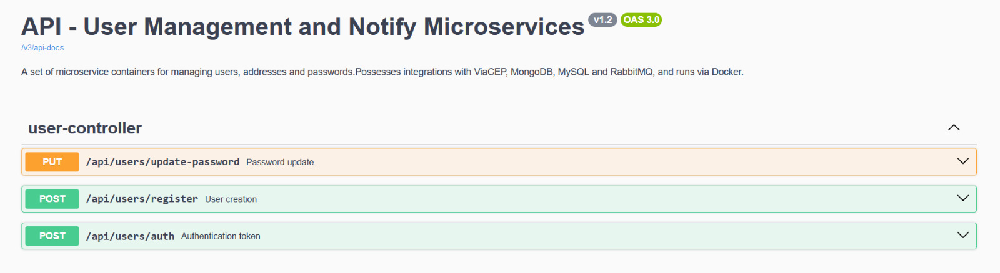
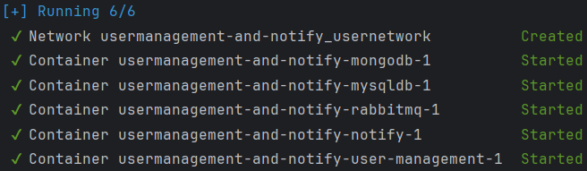

# User Creation API

 A simple API for creating users and updating their passwords via HTTP requests. It features:
  - *RabbitMQ* for logging the events in the *Notify* microservice.
  - *MySQL Database* for user and address data persistence.
  - *JWT* for authentication.
  - *ViaCEP* for fetching addresses.
  - *MongoDB* for persisting *Notify*'s logs.

## Endpoints and Usage

 The endpoints are accessed with the 8080 port, once all containers are up and running. Example:
    
    localhost:8080/api/users/auth

### User Creation
 For user creation, send a POST request to "/api/users/register" with the following JSON body, changing the words "example" to appropriate values:

        {
            "username": example,
            "password": example,
            "email": example,
            "cep": example
        }
    
### Password Update
 To update an existing user's password, send PUT request to "/api/users/update-password" with the following JSON body, changing the words "example" to appropriate values:

        {
            "username": example,
	        "oldPassword": example,
	        "newPassword": example
        }
 This endpoint is protected. The request must contain an Authentication Bearer token, which can be obtained in the next endpoint.

### Authentication
 To obtain a token for use in updating a password, send a POST request to "/api/users/auth", with the following JSON body, changing example for the credentials of an existing user:

    {
        "username": example,
        "password": example
    }

### Swagger UI
 To access the Swagger UI documentation, go to the "/swagger-ui/index.html#/" endpoint in your browser of choice.
 This interface will show all other endpoints and their response codes.
  

  

## Tools Used
    Intellij Ultimate 2024.2
    Docker 27.1.1
    Java 17
    Maven 3.9.9
    Insomnia 10.1.1
    MySQL Server & Workbench 8
    MongoDB 5 & Compass 1.44.6
    Spring Boot 3.3.5

## How to Run
 You will need Git, Maven and Docker installed in order to run this service. Clone this repository to a local directory with:

    git clone https://github.com/daysources/usermanagement-and-notify.git

Make sure you have Docker running and enter the "notify" directory. Make sure you can see the "Dockerfile" in there, and open a PowerShell prompt, running the command:
    
    mvn clean package -DskipTests
Wait until you see a message "BUILD SUCCESS", and repeat this process for the "thirdchallenge" directory. Then, return to the root, making sure you can see the "docker-compose.yml" file, and run the PowerShell command there:

    docker compose up -d --build

 Wait for a while as Docker builds and runs the containers, and soon you will see their status in the prompt. From there, use the 8080 port to make the HTTP requests described in the "Endpoints and Usage" section, with a tool such as Insomnia or similar, or a browser for the Swagger UI.

 

  

 
 You can also use MySQL Workbench to check for data persistence upon user creation:
 (Port: 3306, User: root, Password: 1234567)

 And MongoDB Compass to check the Notify logs:
 (Port: 27017)
 
 If there are any issues during startup, please try to stop the notify and user management containers, wait five seconds and start them again.
